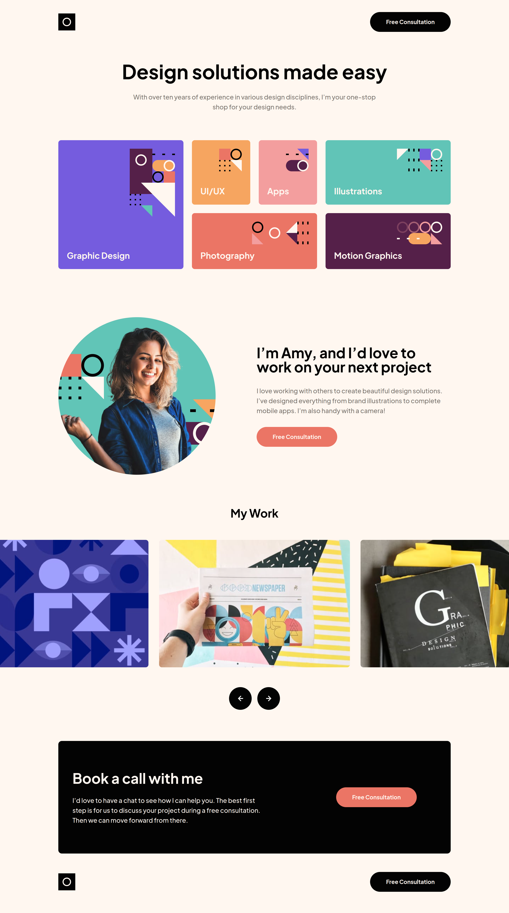
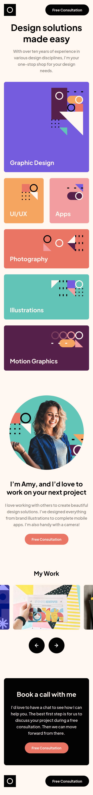

 <h1>Single-page design portfolio solution</h1>

Another Fontend Mentor challenge with Tailwind CSS

[Live URL](https://ivaberiashvili.github.io/single-page-design-portfolio/) | [Solution]() | [Challenge on Frontend Mentor](https://www.frontendmentor.io/challenges/singlepage-design-portfolio-2MMhyhfKVo)
:-------------------------:|:-------------------------:|:-------------------------:

## The challenge

Users should be able to:

- View the optimal layout for the site depending on their device's screen size
- See hover states for all interactive elements on the page
- Navigate the slider using either their mouse/trackpad or keyboard

## The Solution
Desktop             |  Mobile
:-------------------------:|:-------------------------:
  |  

### Built with

- Semantic HTML5 markup
- Tailwind CSS
- Mobile-first workflow
- Vanilla JS

### Author
- [Iva](https://github.com/ivaberiashvili/)

